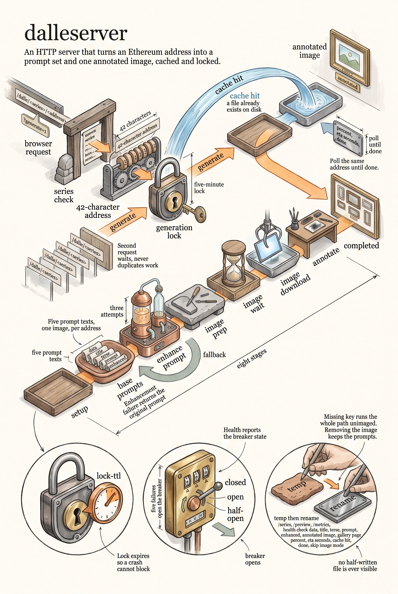

# trueblocks-dalleserver

An example HTTP server demonstrating how to build image experiences on top of the
[`trueblocks-dalle`](https://github.com/TrueBlocks/trueblocks-dalle) Go package.

It turns Ethereum addresses into consistently generated, stylistically filtered ("series")
images. This repo shows a server approach; a companion desktop / direct usage example can
build images without HTTP by calling the same library functions.


## Why this repo exists

Developers often ask: "How do I actually use the `trueblocks-dalle` module in a program?"

This code answers that by demonstrating:

* Discovering and validating a "series" (prompt filter set) at runtime
* Generating prompts (data / title / terse / full / enhanced) for an address
* Optionally enhancing prompts via OpenAI (LLM) with timeouts + fallbacks
* Generating and annotating DALL·E images (or skipping in offline mode)
* Caching + locking so concurrent requests don’t stampede
* Exposing a REST API and a gallery preview page
* Testing, linting, benchmarking and baseline capture

If you only need library usage, jump to [Direct library usage](#direct-library-usage).

## Quick start

```bash
git clone https://github.com/TrueBlocks/trueblocks-dalleserver.git # or: git clone git@github.com:TrueBlocks/trueblocks-dalleserver.git
cd trueblocks-dalleserver
cp .env.example .env            # create and edit (.env is auto-loaded)
make run                        # builds then starts :8080
open http://localhost:8080/preview
```

List available series:

```bash
curl http://localhost:8080/series
```

Fetch (or trigger) an image:

```bash
open "http://localhost:8080/dalle/simple/0xf503017d7baf7fbc0fff7492b751025c6a78179b?generate=1"
```

Preview gallery:

```
http://localhost:8080/preview
```

## Make targets

| Command               | Purpose |
|-----------------------|---------|
| `make build`          | Build the `trueblocks-dalleserver` binary |
| `make run`            | Build + run server on :8080 |
| `make build-book`     | Build the mdBook documentation |
| `make lint`           | Install + run golangci-lint (pinned) |
| `make test`           | Run tests (image generation skipped) |
| `make race`           | Run race detector tests (skip image) |
| `make bench`          | Run all benchmarks (skip image) |
| `make benchmark`      | Focused benchmark target |
| `make bench-baseline` | Produce timestamped JSON benchmark artifacts (benchmarks/*.json) |
| `make clean-output`   | Remove generated PNGs |

## Flags

| Flag | Default | Purpose |
|------|---------|---------|
| `--port` | `8080` | Listen port (overridden by `TB_DALLE_PORT` when set) |
| `--lock-ttl` | `5m` | TTL for the per-(series,address) generation lock |
| `--data-dir` | (empty) | Reserved hook for an explicit base data directory (not yet wired into the library storage layer) |

## Environment variables

| Variable | Description | Default |
|----------|-------------|---------|
| `OPENAI_API_KEY` | Key for enhancement + DALL·E image calls (absence forces skip/mock mode) | (none) |
| `TB_DALLE_PORT` | Overrides `--port` | unset |
| `TB_DALLE_SKIP_IMAGE` | `1` to skip actual image generation (offline / fast tests) | unset |
| `TB_DALLE_NO_ENHANCE` | `1` to disable LLM enhancement (use raw prompt) | unset |
| `TB_DALLE_ENHANCE_TIMEOUT` | Override enhance prompt timeout (e.g. `75s`) | `60s` |
| `TB_DALLE_IMAGE_TIMEOUT` | Timeout for image request + download | `30s` |
| `DALLE_QUALITY` | DALL·E quality parameter (`standard`, `hd`, etc.) | `standard` |

The key is read from the shared credential store at
`~/.config/trueblocks/credentials` (via the monorepo's `packages/creds`); the
`OPENAI_API_KEY` environment variable also works. Inject it for a single run
with:

```fish
tb-exec --only OPENAI_API_KEY make run
```

Offline/dev mode:

```fish
set -x TB_DALLE_SKIP_IMAGE 1; make run
```

## Endpoints

| Path | Description |
|------|-------------|
| `/` | Plain text list of the primary endpoints. |
| `/dalle/<series>/<address>` | Returns annotated image if complete; otherwise a JSON progress snapshot (add `?generate=1` to start/force generation, `?remove=1` to delete the annotated PNG). |
| `/series` | Lists available series names. |
| `/preview` | HTML gallery of annotated images (filterable). |
| `/files/...` | Static access to generated output tree. |
| `/health` | Composite health JSON (add `?check=liveness` or `?check=readiness`). |
| `/metrics` | Prometheus text exposition (add `?format=json` for a structured snapshot). |

While a generation is in progress the `/dalle/...` response looks like (truncated):

```json
{
  "series": "simple",
  "address": "0x...",
  "currentPhase": "image_wait",
  "percent": 42.7,
  "etaSeconds": 11.3,
  "done": false,
  "cacheHit": false
}
```

Poll the same URL until `"done": true`; then re-request (optionally without `?generate=1`) to fetch the final PNG.

## Data directory layout

All runtime artifacts live under a base "data directory" owned by the library's
storage package (typically `$HOME/.local/share/trueblocks/dalle`). The
`--data-dir` flag is accepted today as a reserved hook but is not yet wired into
that storage layer.

Derived sub-directories (created automatically):

```
<dataDir>/
  output/
    <series>/
      data/        # Raw data prompt
      title/       # Title prompt
      terse/       # Short prompt
      prompt/      # Full prompt
      enhanced/    # Enhanced (LLM) prompt text
      annotated/   # Final PNG images (watermarked)
  series/          # JSON series definition files
```

The server fails fast on startup if the data directory cannot be created or written.

## Direct library usage

If you want to skip the server and just integrate image generation, import the package:

```go
import (
  dalle "github.com/TrueBlocks/trueblocks-dalle/v6"
  "time"
)

func generateOne(series, addr string, dataDir string) error {
  outputDir := filepath.Join(dataDir, "output")
  _ = os.MkdirAll(outputDir, 0o755)
  _, err := dalle.GenerateAnnotatedImage(series, addr, outputDir, false /* skipImage */, 30*time.Second)
  return err
}
```

Or inside this server, prefer the library helper `storage.OutputDir()` from
`github.com/TrueBlocks/trueblocks-dalle/v6/pkg/storage`.

## Logging

Logging is plain text via the shared `logger` package, mirrored to stderr; there is no
rotating file or JSON logging mode.
A background status printer additionally emits a concise table of active generations
every 2s to stderr.

Set `skipImage` true (or `TB_DALLE_SKIP_IMAGE=1`) for fast / offline usage.

## .env example

See `.env.example` included in the repo for a documented starter file.

## Implementation notes

Key server concerns illustrated here:

* Per-(series,address) locking + TTL to avoid duplicate work
* Simple context + prompt caching inside the `trueblocks-dalle` library
* Timeouts on enhancement + image requests (configurable)
* Circuit breaker + retry wrapper around OpenAI enhancement, falling back to the original prompt
* Prompt + image phase logging (start/end + elapsed)
* Atomic file writes (temp + rename) with retry in `RobustFileOperations`
* Lint (golangci-lint) pinned version for reproducibility
* Benchmarks + baseline JSON artifacts for regression tracking
* Graceful shutdown and HTTP server timeouts (Slowloris protection)

## Linting & testing

```bash
make lint      # runs golangci-lint
make test      # skips network/image by setting TB_DALLE_SKIP_IMAGE=1 internally
```

Run a single benchmark:

```bash
go test -bench=BenchmarkGenerateAnnotatedImage -run=^$ ./...
```

Capture a baseline JSON (for dashboards / diffing):

```bash
make bench-baseline
```

## Troubleshooting

| Symptom | Likely Cause | Fix |
|---------|--------------|-----|
| Server starts in mock mode / no real images | Missing key (skip mode auto-enabled) | Provide `OPENAI_API_KEY` via the creds store or environment |
| Enhancement timeout | Model slow / low timeout | Increase `TB_DALLE_ENHANCE_TIMEOUT` |
| Blank preview page | No images yet | Trigger generation (`?generate=1`) |
| 404 under `/files/` | File not generated yet | Wait for generation to complete |

## License

GNU GPL v3 (or later). See `LICENSE`.

## Contributing

PRs welcome. Please see the core project’s [branching workflow](https://github.com/TrueBlocks/trueblocks-core/blob/develop/docs/BRANCHING.md) for consistency.

1. Fork & branch.
2. Make changes + add tests when practical.
3. `make lint test` must pass.
4. Open PR.

## Contact

Questions / ideas / complaints: join our Discord (linked from [https://trueblocks.io](https://trueblocks.io)).

## Contributors

Thanks to:

* [@tjayrush](https://github.com/tjayrush)
* [@mikeghen](https://github.com/mikeghen)
* And the broader TrueBlocks community


