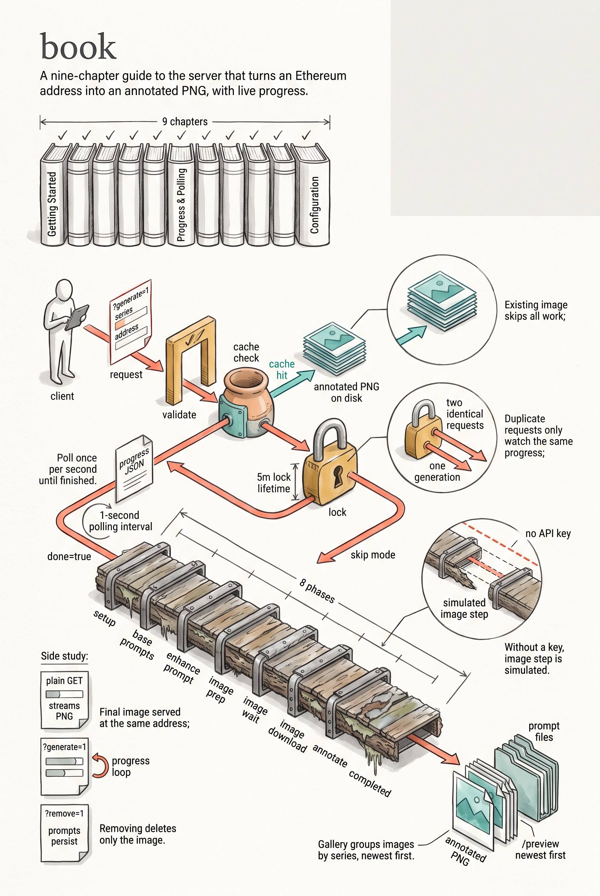

# trueblocks-dalleserver Book

This mini-book documents ONLY what exists in this repository (excluding the vendored / submodule `dalle/` implementation details). It explains how the server works, how to run it, and how to use its endpoints.

## Table of Contents
1. [Introduction](./src/introduction.md)
2. [Getting Started](./src/getting-started.md)
3. [Running the Server](./src/running-the-server.md)
4. [Usage & Endpoints](./src/usage-endpoints.md)
5. [Progress](./src/progress.md)
6. [Configuration Reference](./src/configuration.md)
7. [Preview](./src/preview.md)
8. [Testing](./src/testing.md)
9. [References](./src/references.md)

