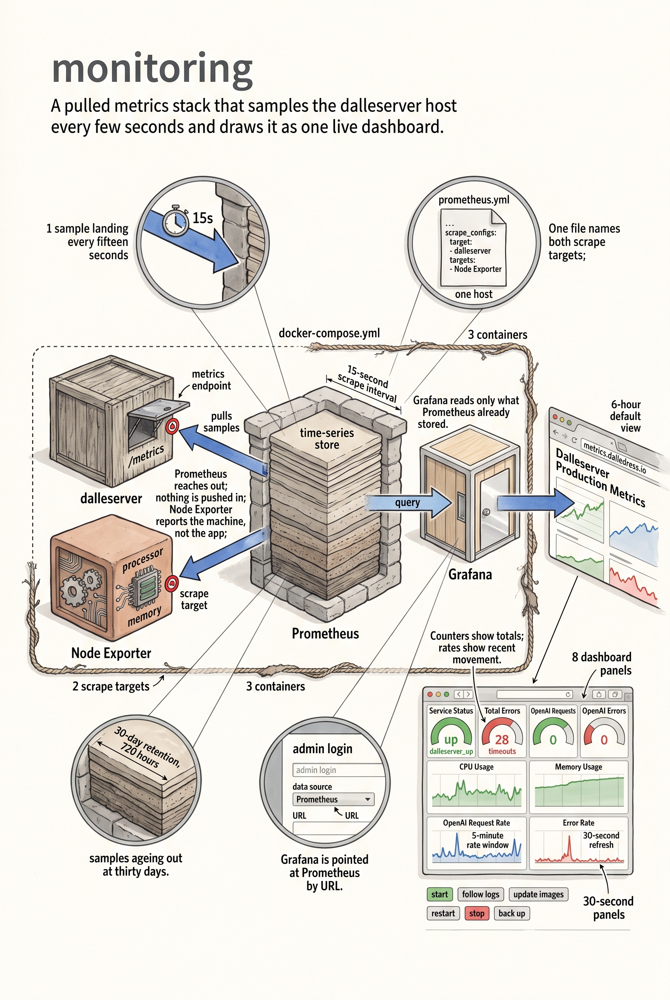

# Monitoring Stack

This directory contains the monitoring infrastructure for dalleserver using Prometheus, Node Exporter, and Grafana.

## Services

- **Prometheus** (port 9090): Time-series database for metrics collection
  - Scrapes dalleserver at 172.17.0.1:8081/metrics every 15 seconds
  - Scrapes Node Exporter:/metrics every 15 seconds
  - 30-day data retention (720 hours)

- **Node Exporter** (port 9100): Linux system metrics (CPU, memory, disk, network)

- **Grafana** (port 3000): Dashboard visualization
  - Public URL: https://metrics.dalledress.io
  - Admin credentials: admin / admin
  - Connected to Prometheus at http://prometheus:9090

## Getting Started

### Start Services
```bash
docker-compose up -d
```

### Access Grafana
1. Visit https://metrics.dalledress.io
2. Log in with admin / admin
3. Add Prometheus data source:
   - Configuration → Data Sources → Add Prometheus
   - URL: http://prometheus:9090
   - Save & test

### Import Dashboard
1. Go to Dashboards → Import
2. Upload `grafana-dashboard-dalleserver.json`
3. Select Prometheus as data source
4. Click Import

### View Metrics
The dashboard ("Dalleserver Production Metrics") defaults to the last 6 hours and refreshes every 30 seconds. It shows:
- **Service Status**: Current `dalleserver_up` value
- **Total Errors**: Cumulative `dalleserver_errors_total`
- **OpenAI Requests**: Cumulative `dalleserver_openai_requests_total`
- **OpenAI Errors**: Cumulative `dalleserver_openai_errors_total`
- **OpenAI Request Rate (5m)**: 5-minute OpenAI request rate
- **Error Rate (5m)**: 5-minute rate of errors, OpenAI errors, and OpenAI timeouts
- **CPU Usage**: Current CPU utilization percentage
- **Memory Usage**: Current memory utilization percentage

## Configuration Files

- `prometheus.yml`: Prometheus scrape configuration
- `docker-compose.yml`: Service definitions
- `grafana-dashboard-dalleserver.json`: Grafana dashboard (JSON model)

## Logs

```bash
# View all services
docker-compose logs -f

# View specific service
docker-compose logs -f prometheus
docker-compose logs -f grafana
```

## Maintenance

### Update Images
```bash
docker-compose pull
docker-compose up -d
```

### Restart Services
```bash
docker-compose restart
```

### Stop Services
```bash
docker-compose down
```

### Backup Grafana Data
```bash
docker exec monitoring_grafana_1 backup
```


